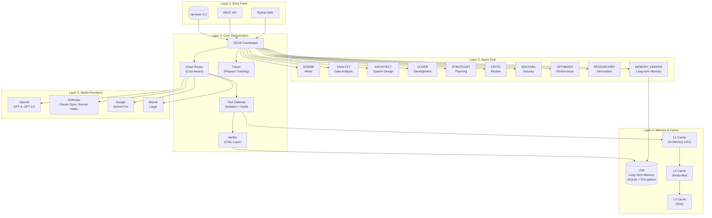
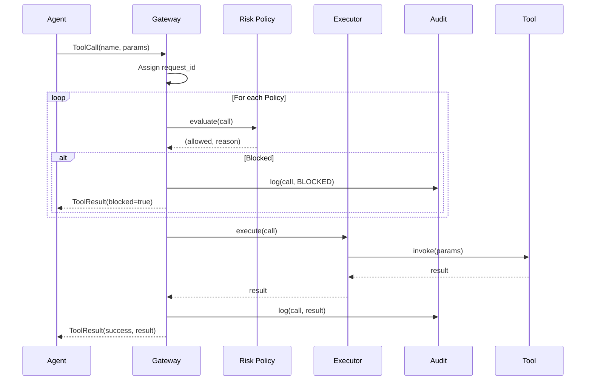
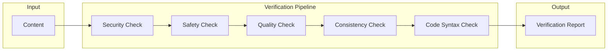
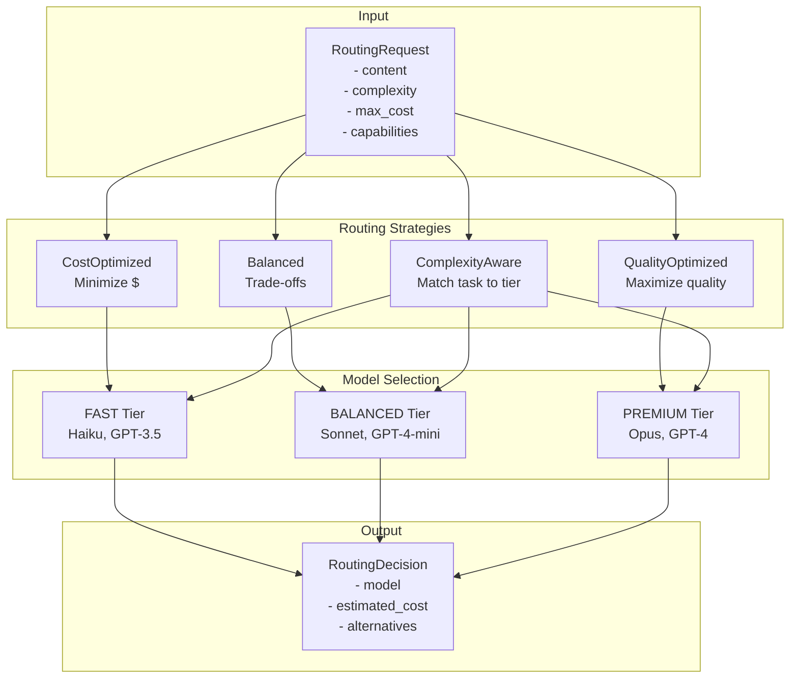
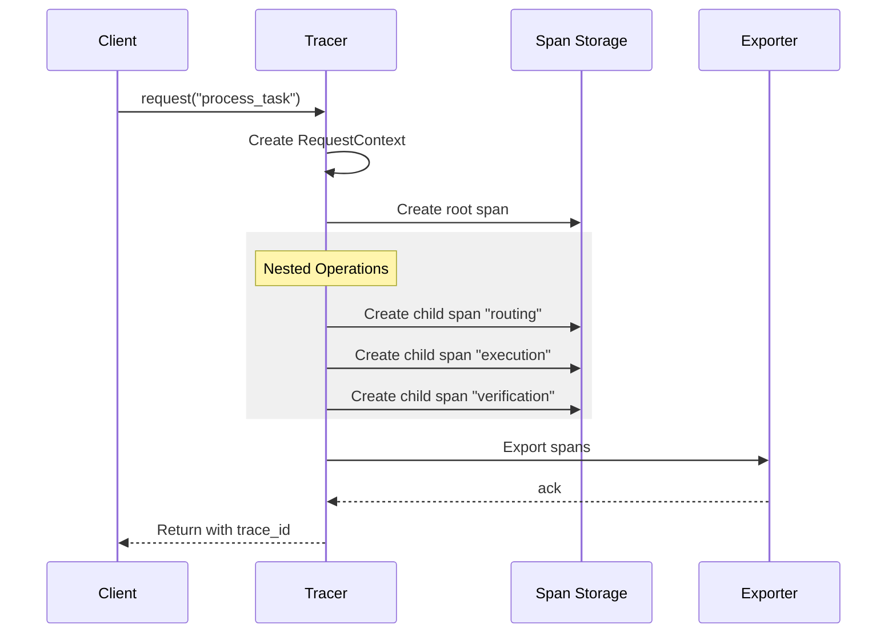
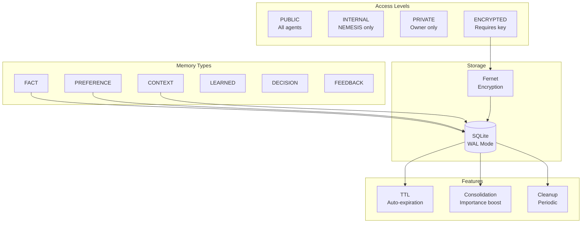
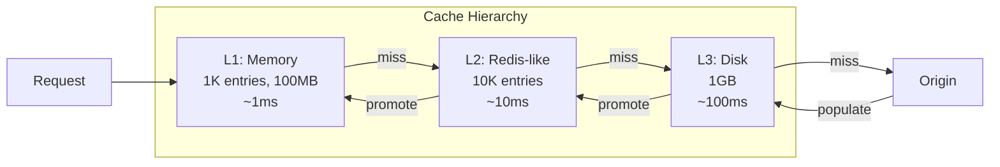
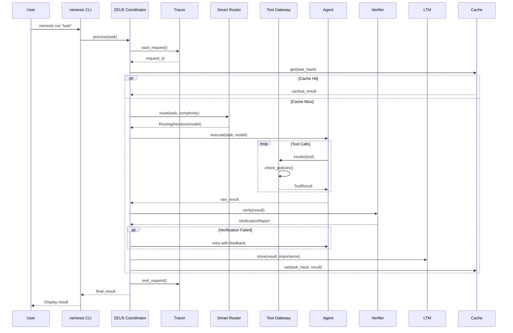

# NEMESIS Architecture
## Neural Expert Multi-agent Efficient System for Integrated Solutions

> **Objectif**: Traiter des tâches complexes avec l'efficacité d'un système simple
> **Principe**: "Faire tourner un mastodonte comme une souris"

---

## Vue d'Ensemble



---

## Composants Critiques

### 1. Tool Gateway (Isolation + Audit)



**Caractéristiques:**
- **Isolation**: Chaque outil s'exécute dans un contexte isolé
- **Rate Limiting**: Max 120 appels/minute par défaut
- **Risk Policies**: LOW/MEDIUM/HIGH/CRITICAL
- **Audit Trail**: Tous les appels sont tracés

```python
# Exemple d'utilisation
from core.gateway import ToolGateway, create_tool_call, RiskLevel

gateway = ToolGateway()
gateway.register_tool(
    "search",
    search_function,
    risk_level=RiskLevel.LOW
)

call = create_tool_call("search", {"query": "test"}, request_id, agent_id)
result = gateway.invoke(call)
```

---

### 2. Verifier (Critic Layer)



**Checks obligatoires:**
- **Security**: Détection patterns dangereux (eval, exec, injection)
- **Safety**: Contenu inapproprié
- **Quality**: Longueur, champs requis
- **Consistency**: Contradictions internes
- **Code Syntax**: Validation Python/JSON

```python
from core.verifier import Verifier, verified

verifier = Verifier()
report = verifier.verify(content)

if not report.passed:
    raise VerificationError(report.failed_checks)

# Ou avec décorateur
@verified(checks=["security", "safety"])
def generate_response(prompt):
    return llm.complete(prompt)
```

---

### 3. Smart Router (Cost-Aware)



**Mapping Complexité -> Tier:**
| Complexité | Tier | Modèles |
|------------|------|---------|
| TRIVIAL | FAST | Haiku, GPT-3.5 |
| LOW | FAST | Haiku, GPT-3.5 |
| MEDIUM | BALANCED | Sonnet, GPT-4-mini |
| HIGH | PREMIUM | Opus, GPT-4 |
| EXPERT | PREMIUM | Opus, GPT-4 |

```python
from core.router import SmartRouter, RoutingRequest, TaskComplexity

router = SmartRouter(budget_limit_daily=10.0)

request = RoutingRequest(
    request_id="req_123",
    content="Design a microservices architecture",
    complexity=TaskComplexity.EXPERT,
    max_cost=0.50
)

decision = router.route(request, strategy="balanced")
print(f"Model: {decision.model.name}")
print(f"Est. Cost: ${decision.estimated_cost:.4f}")
```

---

### 4. Tracer (Request Tracking + Record/Replay)



**Features:**
- **Request ID**: Identifiant unique pour chaque requête
- **Trace Correlation**: Propagation à travers les services
- **Record/Replay**: Enregistrement pour débogage

```python
from core.tracer import get_tracer, trace

tracer = get_tracer()

# Recording for replay
tracer.start_recording()

with tracer.request("user_query", user_id="user_123") as ctx:
    print(f"Request ID: {ctx.request_id}")

    with tracer.span("routing"):
        # routing logic
        pass

    with tracer.span("execution"):
        # execution logic
        pass

traces = tracer.stop_recording()
tracer.save_recording("debug_session.json")

# Later: replay
tracer.replay(tracer.load_recording("debug_session.json"))
```

---

### 5. Long-Term Memory (LTM)



**Caractéristiques:**
- **TTL**: Expiration automatique (30 jours par défaut)
- **Encryption**: Chiffrement Fernet pour données sensibles
- **Consolidation**: Boost d'importance pour mémoires fréquemment accédées
- **Access Control**: 4 niveaux d'accès

```python
from memory.ltm import LongTermMemory, MemoryType, AccessLevel

ltm = LongTermMemory(
    db_path="nemesis_memory.db",
    default_ttl_hours=720  # 30 days
)

# Store with encryption
entry = ltm.store(
    content={"secret": "data"},
    memory_type=MemoryType.FACT,
    access_level=AccessLevel.ENCRYPTED,
    importance=0.9
)

# Search
results = ltm.search(
    query="project",
    memory_type=MemoryType.DECISION,
    min_importance=0.5
)
```

---

### 6. Multi-Level Cache



```python
from memory.cache import ContextCache

cache = ContextCache(
    l1_size=1000,
    l2_size=10000,
    l3_size_mb=1000
)

# Simple usage
cache.set("key", {"data": "value"}, ttl_seconds=3600)
value = cache.get("key")

# Decorator
@cache.cached(ttl_seconds=600)
def expensive_operation(param):
    return compute(param)
```

---

## Flux de Requête Complet



---

## Patterns Implémentés

### Pattern 1: Circuit Breaker
```python
# Dans workers/base.py
class CircuitBreaker:
    states: CLOSED -> OPEN -> HALF_OPEN -> CLOSED
    failure_threshold: 5
    recovery_timeout: 60s
```

### Pattern 2: Request Coalescing
```python
# Multiple requests identiques = 1 seul appel
coalescing_window: 100ms
```

### Pattern 3: Graceful Degradation
```
Tier 1: Full service (Opus)
Tier 2: Reduced (Sonnet)
Tier 3: Minimal (Haiku)
Tier 4: Cache only
Tier 5: Error response
```

### Pattern 4: Speculative Execution
```python
# Exécuter sur 2 modèles, retourner le premier
async def speculative_execute(task):
    results = await asyncio.gather(
        model_a.execute(task),
        model_b.execute(task),
        return_exceptions=True
    )
    return first_success(results)
```

---

## Commandes CLI

```bash
# Exécuter une tâche
nemesis run "Explain machine learning"

# Recommandation de routage
nemesis route "Write a Python function" --budget 0.10

# Vérifier du contenu
nemesis verify --file script.py --type code

# Gestion mémoire
nemesis memory stats
nemesis memory search --query "project"
nemesis memory consolidate

# Gestion cache
nemesis cache stats
nemesis cache clear --levels l1,l2

# Statistiques système
nemesis stats

# Configuration
nemesis config show
nemesis config edit

# Demo interactive
nemesis demo
```

---

## Structure des Fichiers

```
ai-orchestrator/
├── core/
│   ├── __init__.py
│   ├── gateway.py      # Tool Gateway avec isolation et audit
│   ├── verifier.py     # Critic Layer obligatoire
│   ├── router.py       # Smart Router cost-aware
│   └── tracer.py       # Request tracking et Record/Replay
├── memory/
│   ├── __init__.py
│   ├── ltm.py          # Long-term memory (TTL + encryption)
│   └── cache.py        # Multi-level cache (L1/L2/L3)
├── workers/
│   └── base.py         # Circuit Breaker, Response Cache
├── nemesis.py          # CLI entry point
├── config.yaml         # Configuration complète
├── architecture.md     # Ce document
└── tests/
    └── test_*.py       # Tests unitaires
```

---

## Métriques de Succès

| Métrique | Cible | Actuel |
|----------|-------|--------|
| Latence P50 | < 2s | - |
| Latence P99 | < 10s | - |
| Taux d'erreur | < 1% | - |
| Cache hit rate | > 40% | - |
| Coût moyen/requête | < $0.05 | - |
| Uptime | 99.9% | - |

---

## Prochaines Étapes

1. [ ] Implémenter les tests d'intégration
2. [ ] Ajouter OpenTelemetry export
3. [ ] Dashboard de monitoring
4. [ ] API REST avec FastAPI
5. [ ] Déploiement Docker/K8s
