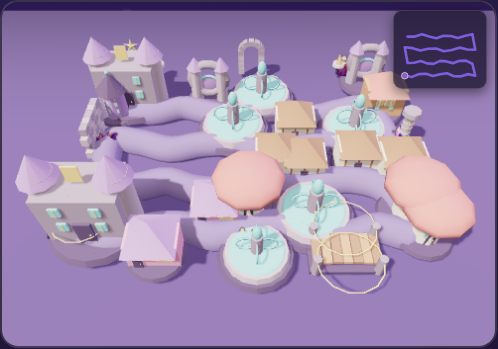

# Lot 5 — séquence animateur et preuve WebGL

Ce lot correctif reprend les quatre livraisons 3D/voix après leur intégration
sur la branche du jeu.

## Voix

- Les 12 clips de réaction jusque-là présents mais inutilisés sont maintenant
  joués après une réponse individuelle.
- L'ordre audible est déterministe :
  `réaction bonne/mauvaise → lancement d'anecdote → lecture de l'anecdote`.
- Si Opus ou l'autoplay échoue, Web Speech reprend les accroches restantes et
  le texte variable sans couper la narration.
- Le premier tirage peut sélectionner chacun des clips ; la non-répétition
  immédiate reste active ensuite.

## 3D et repli

`tools/smoke-3d.mjs` ouvre directement le fichier autonome en `file://`, force
un profil matériel compatible, puis vérifie :

- canvas WebGL visible et plateau 2D masqué ;
- mini-carte visible ;
- deux héros GLB/Draco réellement chargés ;
- aucun repli 3D, aucune requête échouée, aucune erreur de page.

Le renderer 2D, la détection de capacité et le mode mouvements réduits ne sont
pas modifiés.

## Vérification

```bash
node tools/test-voice.mjs
node tools/test-hero-models.mjs
node tools/test-decor-models.mjs
node tools/test-ambience-3d.mjs
node tools/build-standalone.mjs
CHROMIUM_PATH=/chemin/chromium node tools/smoke-3d.mjs
```


